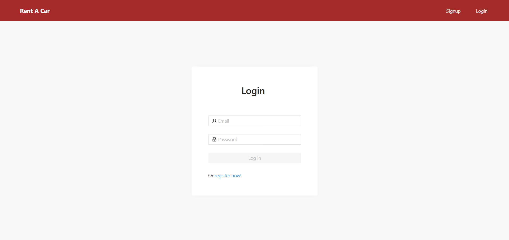
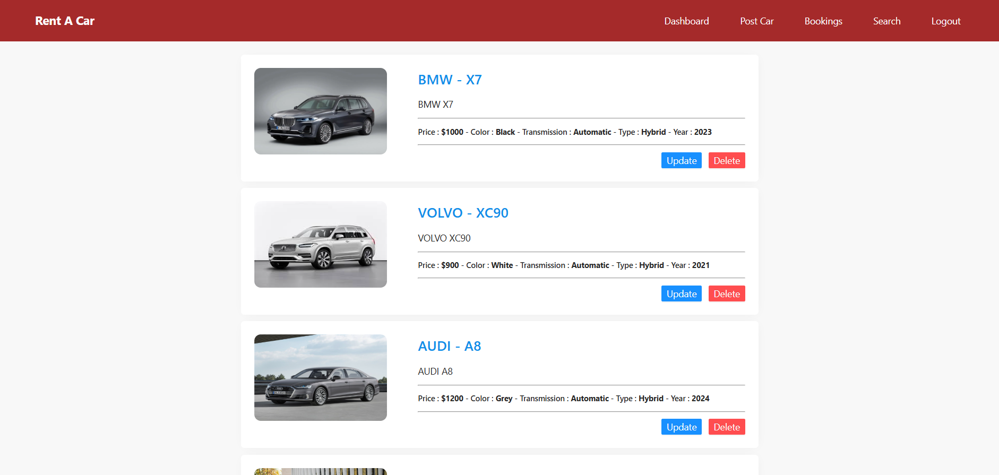
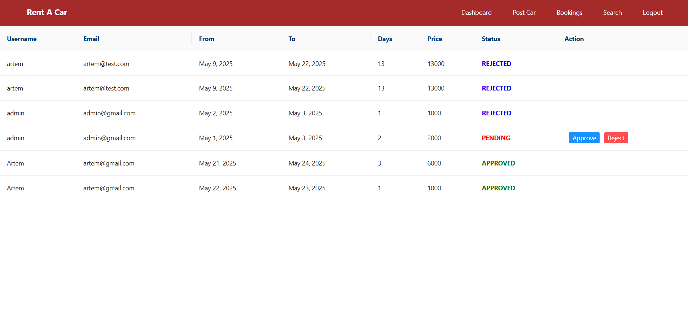
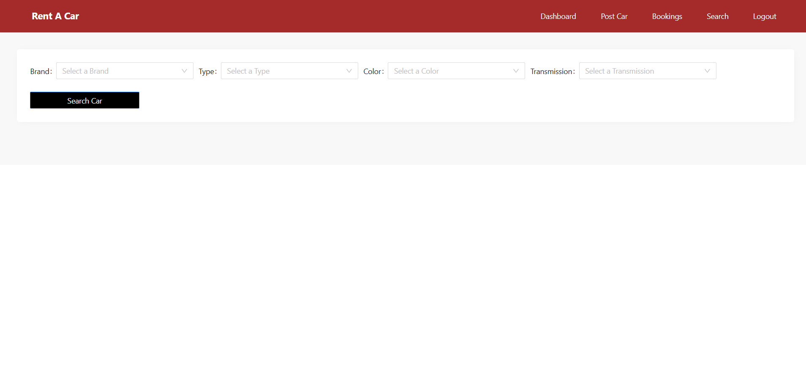
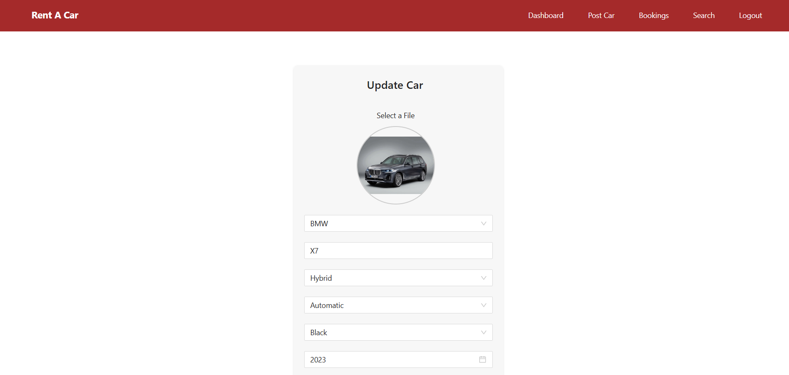
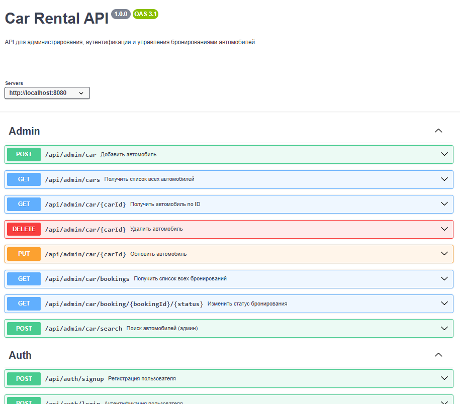

# CarRental
Приложение для бронирование автомобилей

## Используемые технологии

## Старт
### Локальный старт подразумевает, что на компьютере уже установлен Mysql
1) #### ***Локальный старт***
* Клонировать репозиторий `git clone https://github.com/Artemis271/CarRental`
* Открыть через IDE
* Скачать необходимые сервисы с помощью команды `docker-compose up --build`
* Установить все необходимые для каждого сервиса переменные окружения
* Настроить схему БД (схема к каждому сервису есть в директории resources)
* Запустить клиентскую часть, перейдя в директорию **Angular** и 
ввести команду `ng serve start`
* Запустить все бэкенд сервисы на Java Spring Boot
* Перейти на **localhost:4200**

2) #### ***Старт через Docker***
* Клонировать репозиторий `git clone https://github.com/Artemis271/CarRental`
* Скачать необходимые сервисы с помощью команды `docker-compose up --build`
* Перейти на **localhost:4200**

## Демо
1) Страница авторизации  
   
2) Страница просмотра автомобилей для администратора  
   
3) Страница добавления новой машины для администратора  
   
4) Страница обработки заявок для администратора  
   
5) Страница фильтрации для быстрого поиска подходящей машины по различным параметрам  
   
6) Страница обновления новой машины для администратора
   
7) Документация эндпоинтов через openAPI  
    
